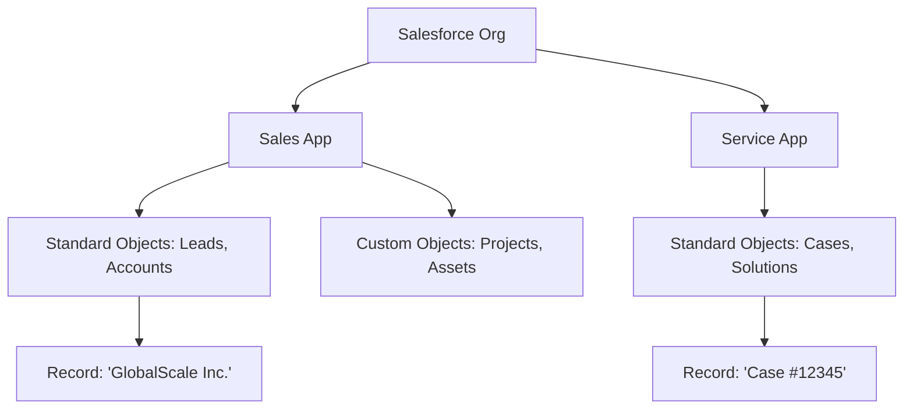

# 🌐 Day 1: Salesforce Architecture & Enterprise Fundamentals

## Profile
- **Challenge**: 25-Day Salesforce Mastery
- **Phase**: Admin Mastery (Brushing up skills)
- **Focus**: CRM Strategy, Multitenancy, Platform Hierarchy, Governance

## 🧩 Strategic CRM Concepts
Before technical execution, an elite Admin understands the **Why**. 
- **CRM Strategy**: Managing the customer lifecycle (Lead → Opportunity → Loyalty) to drive ROI.
- **Multitenancy**: Shared infrastructure with dedicated data silos—ensuring security and performance at scale.
- **Cloud Computing (SaaS/PaaS)**: Why businesses choose the "No Software" approach to focus on innovation over infrastructure.

## 🏛️ Salesforce Governance: Editions & Licenses
Choosing the right "Org" type is a strategic governance decision:
- **Editions (The Cap)**: Professional (limited), Enterprise (API/Automation ready), and Unlimited (full scale).
- **Licenses (The Entry)**: 
    - **Salesforce License**: Full access to CRM data.
    - **Platform License**: Custom app access (no Leads/Opps).
    - **Integration License**: For system-to-system connectivity.

## 🗺️ Platform Architecture Diagram
Visualizing the relationship between the Org, Apps, Objects, and Records:

## 🔗 Linking Relations Effectively
The power of Salesforce lies in how data is connected:
- **Org Level**: The secure bubble for your business data.
- **App Level**: Collections of Objects tailored for specific business functions (Sales vs. Support).
- **Object Level**: The "Tables" where data structure is defined.
- **Record Level**: The actual business assets—where values live.

## Technical Execution
I audited and optimized the following core platform settings to meet global enterprise standards:

### 1. Global Financial & Operational Setup
- **Multi-Currency Management**: Activated and configured multi-currency support to enable unified global reporting across USD, EUR, and GBP.
- **Fiscal Governance**: Sync'd the Salesforce Fiscal Year to aligned financial cycles, ensuring 100% accuracy in forecasting and quota reporting.
- **Business Hours & SLAs**: Defined granular Business Hours and Holiday schedules to ensure Case Escalation and Service SLAs are calculated precisely across time zones.

## 🏛️ Governance Architecture
To ensure long-term Org health and scalability, I established the following governance guardrails:
- **UI Governance**: Controlled App Menu visibility and defined a standardized corporate Theme to ensure a consistent, non-cluttered UX across business units.
- **Localization Standards**: Established a "Base Currency" and documented the update frequency for dated exchange rates to maintain financial data integrity.
- **Standardization Policy**: Defined business hour naming conventions (`[Region] - [Service Level]`) to allow for seamless automation in child business units.
- **Audit Preparedness**: Activated the **Setup Audit Trail** and **Health Check** monitoring to track configuration changes and platform vulnerabilities.

### 2. Branding & UI Optimization
- **Enterprise UX**: Deployed custom Themes & Branding to align the Salesforce experience with corporate identity, improving user adoption.
- **App Menu Governance**: Streamlined the App Launcher to reduce cognitive load and improve navigation speed for Sales and Service teams.

## 🛠️ Technical Execution: The "Elite" Foundation
To demonstrate these concepts, I configured the following in a dedicated **Developer Edition Org**:
1.  **Company Information**: Defined localized settings to support global operations.
2.  **Multitenancy Check**: Audited the **Health Check** to ensure shared infrastructure security.
3.  **UI Governance**: Controlled App Launcher visibility to align with the hierarchy diagram above.

## Impact & Key Insights
- **Standardization**: Architecting data links correctly prevents "Org Bloat."
- **License Optimization**: Understanding licenses ensures cost-effective platform scaling.
- **Global Ready**: Foundational knowledge of CRM is the precursor to complex automation.

---
*Part of the 25-Day Salesforce Mastery Sprint.*
