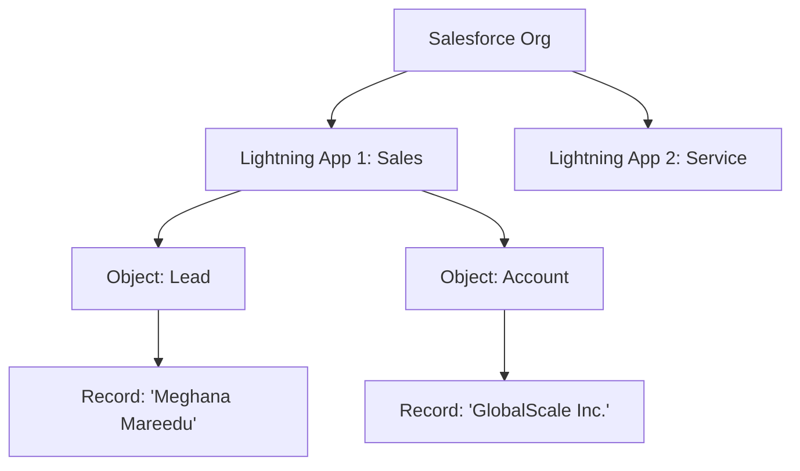

# 🌐 Day 1: Salesforce Fundamentals & Cloud Architecture

## 🎯 Strategic CRM Concepts
Before technical execution, an elite Salesforce professional must master the foundation of **Customer Relationship Management (CRM)**.
- **What is Salesforce?**: A cloud-based platform designed to bridge the gap between businesses and customers through a unified view of every interaction.
- **The Power of CRM**: It’s not just a database; it’s a strategy for managing the entire customer lifecycle—from initial lead acquisition to long-term loyalty and support.
- **Multi-tenant Architecture**: Understanding how Salesforce hosts multiple "tenants" (businesses) on a shared infrastructure while maintaining absolute data isolation and security.

## 🏛️ Platform Governance: Editions & Licenses
Choosing the right "Org" type and access level is a critical architectural decision.

### 1. Salesforce Editions
- **Professional**: Basic CRM features for small-to-medium businesses.
- **Enterprise**: The standard for global corporations (Full API access, advanced automation).
- **Unlimited**: Full platform power with maximum scale and premium support.

### 2. Licenses & Access
- **Salesforce License**: Grants full access to standard CRM objects (Leads, Opps, Cases).
- **Salesforce Platform License**: Optimized for custom apps (No access to standard Sales/Service objects).
- **Identity License**: For users who only need authentication services.

## 🗺️ Platform Architecture & Hierarchy
The Salesforce data model is structured in a clear, parent-child hierarchy.

### Linking Relations:
1. **Org**: The top-level secure environment (your instance).
2. **App**: A collection of objects tailored for a specific business process (e.g., Sales App).
3. **Object**: The "table" or container that defines data types (e.g., Accounts).
4. **Record**: The specific row of data containing your business assets.

## 🛠️ Environment Setup: Developer Org
To demonstrate these concepts, I have successfully provisioned a **Salesforce Developer Edition Org**:
- **Purpose**: A free, full-featured environment for building, testing, and mastering the platform.
- **Outcome**: A "Production-Lite" environment ready for deep-dive configuration and development.

---
*Building the foundation for elite Salesforce mastery.*
