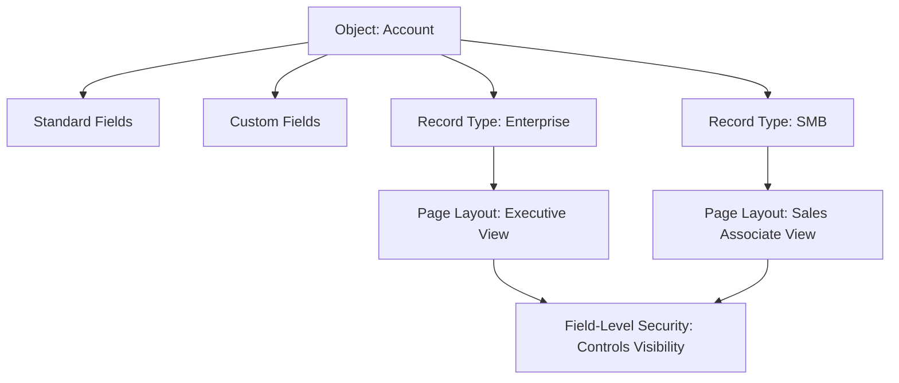

# 🏗️ Day 2: Data Modeling & UI Orchestration

## 🎯 Strategic Concepts: Objects & Fields
In an enterprise Salesforce environment, the data structure must be both rigid for integrity and flexible for business evolution. Today's focus is on "brushing up" the core building blocks of the platform.

### 1. Standard vs. Custom Objects
- **Standard Objects**: Out-of-the-box tables like `Account`, `Contact`, and `Opportunity` that come with pre-built business logic.
- **Custom Objects**: Tailor-made tables (e.g., `Equipment__c`) built to handle unique industry requirements.

### 2. Fields & Data Integrity
- **Data Types**: Choosing the right type (Formula, Roll-up Summary, Percent, Currency) is crucial for reporting and validation.
- **Field-Level Security (FLS)**: The baseline for data privacy. FLS ensures that sensitive data (like "Annual Revenue") is only visible to the right personas, regardless of page layout settings.

## 🎨 UI Architecture: Page Layouts & Record Types
Managing how different personas interact with the same data is a key Admin skill.

- **Page Layouts**: Control the organization of fields, buttons, and related lists.
- **Record Types**: Allow for different business processes, picklist values, and page layout assignments on a single object.

## 🗺️ Relationship & UI Logic Diagram
Visualizing how these components orchestrate the user experience:

## 🛠️ Technical Execution
To demonstrate these concepts, I performed the following in the Developer Org:
1.  **Object Creation**: Drafted a Custom Object to store industry-specific data.
2.  **Field Engineering**: Configured diverse data types and enforced **Field-Level Security** to adhere to the "Least Privilege" principle.
3.  **UI Orchestration**: Designed custom **Page Layouts** and assigned them via **Record Types** to simulate different business segments.

## Impact & Key Insights
- **Modularity**: Using Record Types allows for scalability without creating redundant objects.
- **Security First**: FLS is the primary guardrail for data protection at the field level.
- **UX Consistency**: Page Layouts ensure that users only see the information relevant to their specific role.

---
*Part of the 25-Day Salesforce Mastery Sprint.*
